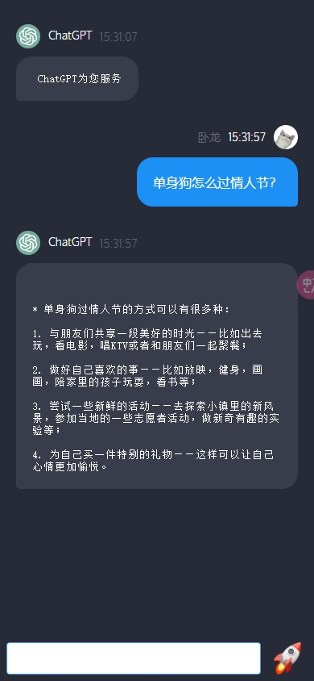
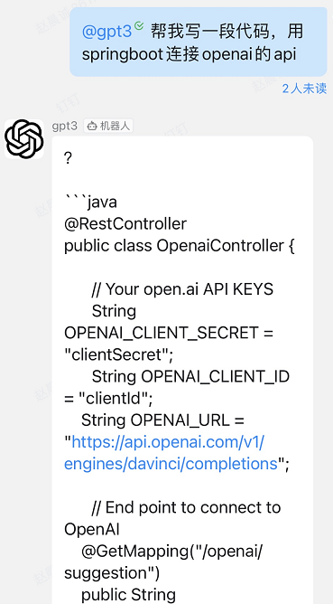
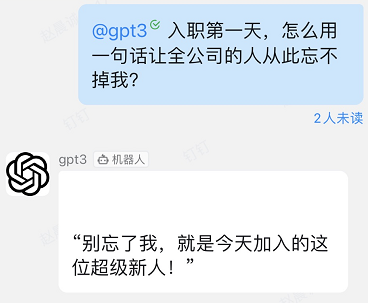
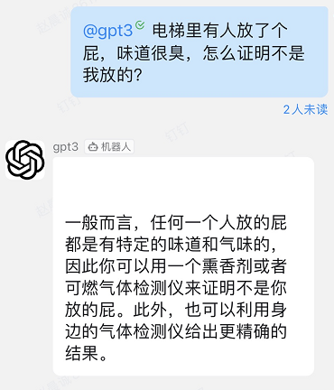
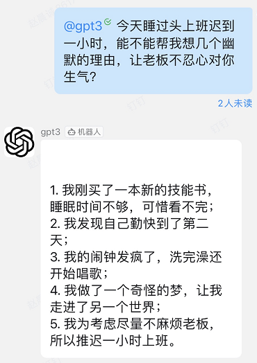
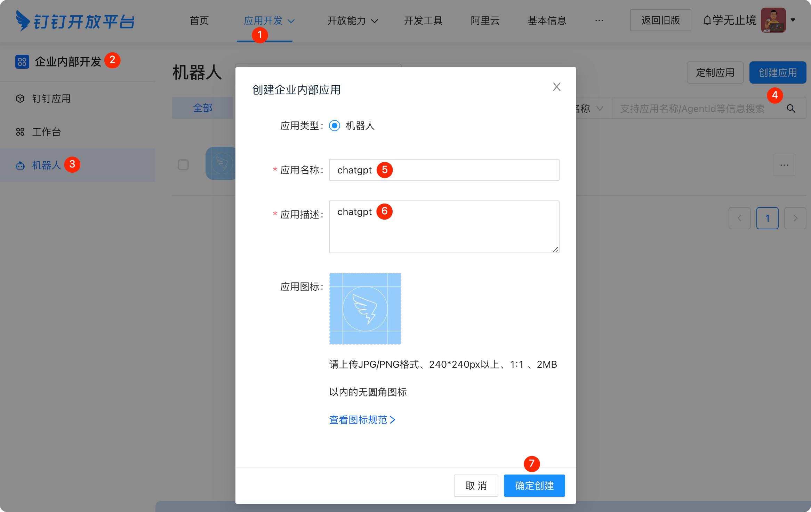
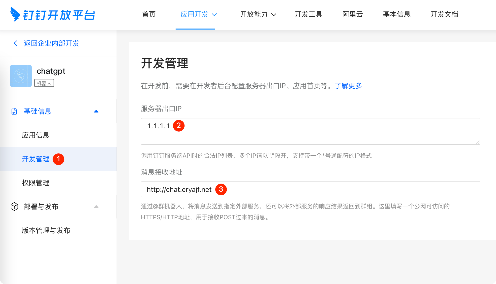
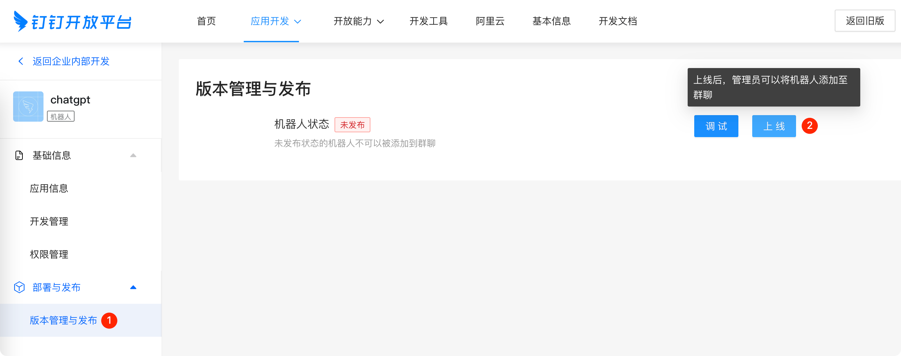
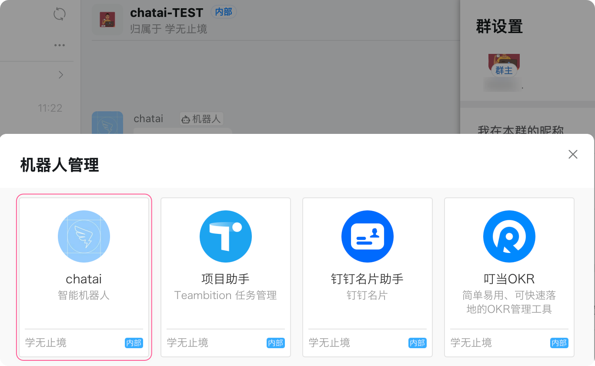

## 介绍
- 本项目是一个基于Springboot的一个后端服务，用于实时接收chatGPT的消息，并通过websocket的方式实时反馈给前端。
- 本项目还可以助你将GPT机器人集成到钉钉群聊中，通过@机器人进行聊天交互。
### 前端页面截图：
- 
- 
### 钉钉使用截图：
- 
- 
- 
- 

## 使用前提
* 有Openai账号，并且创建好`api_key`，注册相关事项可以参考[此文章](https://juejin.cn/post/7173447848292253704) 。访问[这里](https://beta.openai.com/account/api-keys)，申请个人秘钥。
* 在钉钉开发者后台创建机器人，配置应用程序回调。

## 使用教程

### 钉钉创建机器人

创建步骤参考文档：[企业内部开发机器人](https://open.dingtalk.com/document/robots/enterprise-created-chatbot)，或者根据如下步骤进行配置。

1. 创建机器人。
   

   > `📢 注意：`可能现在创建机器人的时候名字为`chatgpt`会被钉钉限制，请用其他名字命名。

   步骤比较简单，这里就不赘述了。

2. 配置机器人回调接口。
   

   创建完毕之后，点击机器人开发管理，然后配置将要部署的服务所在服务器的出口IP，以及将要给服务配置的域名。

3. 发布机器人。
   

   点击版本管理与发布，然后点击上线，这个时候就能在钉钉的群里中添加这个机器人了。

4. 群聊添加机器人。

   

## 前端项目地址
* github: https://github.com/zccbbg/chatgpt-vue
* gitee: https://gitee.com/zccbbg/chatgpt-vue
## 关于我们
* 开发团队成立5年，我们前端开发、后端架构，有一颗热爱开源的心，致力于打造企业级的通用产品设计UI体系让项目 或者更直观，更高效、更简单，未来将持续关注UI交互，持续推出高质量的交互产品。
* 这五年我主要做isv对接淘宝、拼多多、抖音、美团等平台的订单处理应用，日处理订单300w条，因为要熟悉业务也开过淘宝和拼多多店铺运营了一个网易严选的品牌。我们的公众号会陆续更新一些我一边撸代码一边做客服的经历。也会更新一些我的读书笔记以及编程、创业、生活中踩坑的文章。另外还会开放一些米哈游、博世、企查查、同程、阿里、京东、拼多多等大厂、中厂或外企的内推岗位！
* 交流合作可加微信：zccbbg
## 交流群
* 关注公众号“字节叔叔”回复：加群，即可加入群聊。 
* 